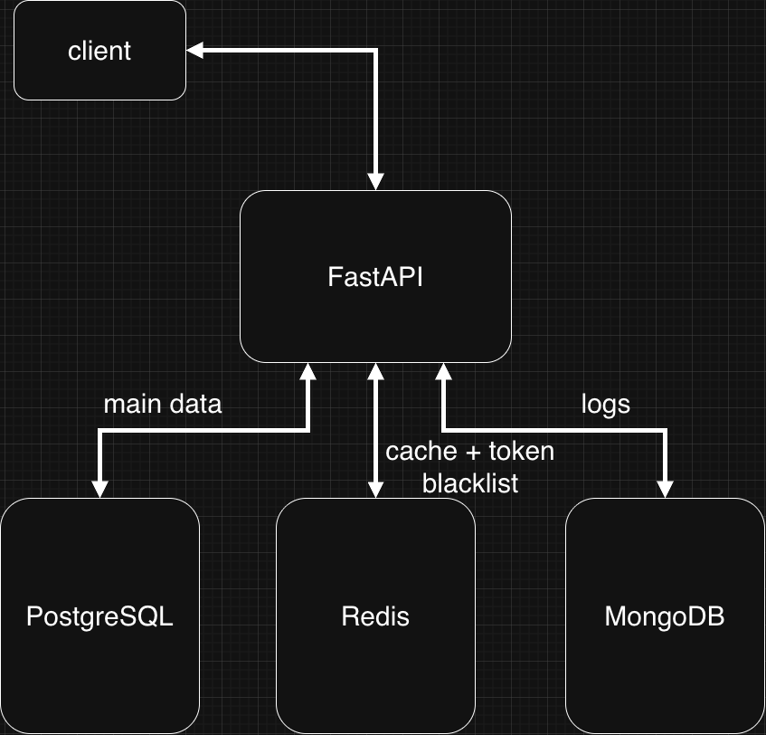

# financial_tracker
Backend-приложение финансовый трекер. Позволяет создавать категории, распределять по ним транзакции, получать статистику, экспортировать статистику и список транзакций в виде csv файла. Целью проекта является знакомство с FastAPI и некоторыми другими библиотеками для создания backend-приложений.

## Стек технологий
- FastAPI
- PostgreSQL
- SQLAlchemy + asyncpg
- Alembic - миграции
- Pydantic V2
- Redis - кеширование данных
- MongoDB (PyMongo) - логирование действий
- pwdlib + bcrypt - хеширование паролей
- PyJWT - JWT токены
- PyTest + fakeredis - проведение тестов

## Архитектура
Проект состоит из трех слоев - `repositories`, `services`, `routers`. У каждого основного элемента проекта (`category`, `transaction`, `analytics`, `user`) есть отдельный файл в каждом из слоев.
- `repositories` - отвечает за обращение к базе данных PostgreSQL. 
- `services` - отвечает за обработку обращения, кеширование, логирование данных.
- `routers` - отвечает за endpoint и формирование api запроса к серверу

Проект состоит из трех баз данных.
- PostgreSQL - основная база данных
- Redis - отвечает за кеширование данных.
- MongoDB - отвечает за логирование действий пользователя.



### Аутентификация 
После регистрации пользователь может войти в сервис с использованием почты и пароля. Пароли хешируются с помощью `pwdlib` и `bcrypt`. После авторизации пользвателю будет присвоен токен JWT, по которому сервис сможет выполнять авторизацию пользователя. При выходе из сервиса токен пользователя попадает в blacklist в Redis - это не даст пользователю, не выполневшему повторную аутентификаю, выполнять какие либо действия с сервисом.

## Установка и запуск
1. Для запуска данного проекта необходимы:
- Docker и Docker Compose
- Python 3.12
- установка зависимостей 
Через pipenv:
```bash
pipenv install
```
Или через pip:
```bash
pip install -r requirements.txt
```
2. Клонируйте репозиторий
3. Создайте `.env` файл по примеру `.env.example`
4. Запустите docker
```bash
docker-compose up --build
```
5. Выполните миграции 
```bash
PYTHONPATH=. alembic upgrade head
```
6. Приложение будет доступно по `http://localhost:8000`, документация по `http://localhost:8000/docs`

## API Endpoints
Полная документация доступна на `http://localhost:8000/docs`

Основные группы эндпоинтов:
- `/register`, `/login`, `/logout` — аутентификация
- `/transactions` - управление транзакциями
- `/categories` - управление категориями  
- `/analytics` - аналитика по категориям и месяцам
- `/export` - экспорт данных в CSV
- `/activity` - история действий пользователя